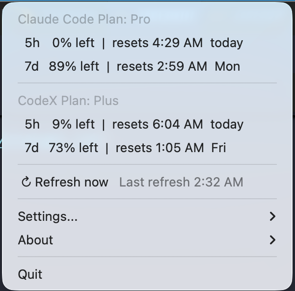

<h1>
  ai-limit for macOS
  
</h1>

`ai-limit` is a lightweight macOS menu bar app for tracking live **Claude Code**
and **Codex** quota before you hit a rate limit.

## The dropdown menubar


## Install

Download the latest DMG from
[GitHub Releases](https://github.com/Nan-Jiang-Group/ai-limit/releases/latest),
then open it and drag `ai-limit.app` into `/Applications`.

This build is not notarized, so macOS Gatekeeper may warn on first launch. If it
does, allow it from:

```text
System Settings -> Privacy & Security -> Open Anyway
```

## Requirements

- macOS
- Chrome or Firefox signed in to [claude.ai](https://claude.ai) and [chatgpt.com](https://chatgpt.com)

## Privacy

`ai-limit` uses your existing local browser session cookies to call Claude and
ChatGPT quota endpoints. It does not upload your data, provide subscriptions, or
bypass quota limits.

If a browser session is missing or expired, the affected monitor shows a warning.

## Compile from Source

See [src/README.md](src/README.md#build-from-source) for build and packaging commands.

## References

- Original project: [zhuchenxi113/ai-limit](https://github.com/zhuchenxi113/ai-limit)